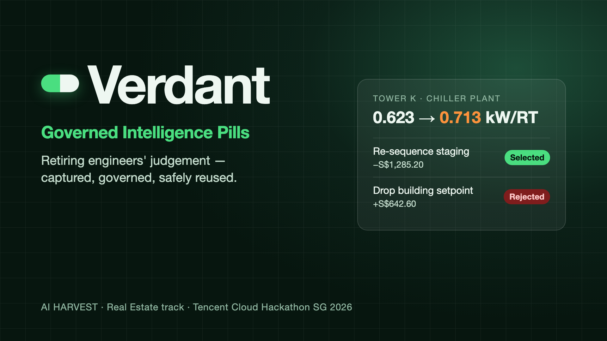

# Verdant — Tower K Energy & Comfort Pill

> **Governed comfort decisions for Tower K — humans approve, code computes, AI only selects.**



> When Tower K's chief engineer retires, his judgement on cooling and comfort stays —
> approved, versioned and measurable.

A governed **Intelligence Pill** platform for a synthetic Singapore Grade-A office tower.
Built for the **Tencent Cloud AI CAN DO IT Hackathon SG 2026** (Real Estate / Keppel, AI HARVEST).

**Core principle:** the AI never writes guidance. It selects an approved pill *by ID*, every
number is computed **deterministically in code**, and a human approves anything that acts.

---

## Contents

- [The problem](#the-problem)
- [The hero case](#the-hero-case)
- [Architecture](#architecture)
- [The console](#the-console)
- [Quickstart](#quickstart)
- [Requirements traceability](#requirements-traceability)
- [The decision pipeline](#the-decision-pipeline)
- [The audit hash chain](#the-audit-hash-chain)
- [Roles (deny by default)](#roles-deny-by-default)
- [API surface](#api-surface)
- [Testing](#testing)
- [Verification](#verification)
- [Tech stack](#tech-stack)
- [Repository layout](#repository-layout)
- [Demo script](#demo-script-5-minutes)
- [Known gaps](#known-gaps)
- [Data notice](#data-notice)

---

## The problem

Tower K's chiller retrofit reads as an aggregate success: energy is down, but nobody can say
*which lever* worked, and the engineer who knows is retiring. The building is full of dashboards
and empty of judgement.

Verdant turns that judgement into a governed artefact — a **pill** — with three properties a
dashboard cannot offer:

1. **Provable** — every claim is pinned to a verbatim quote from the capture interview (FR-02).
2. **Priced** — every option carries a cost delta and a position in the policy hierarchy (FR-04).
3. **Reversible** — versions are immutable, revisions are drafts, and a regression can be rolled
   back to the exact version that worked.

---

## The hero case

A tenant on Level 23 reports *"too hot"* at 14:40. Over two weeks the chiller plant's efficiency
has quietly drifted from **0.6230 → 0.7130 kW/RT**. The intuitive fix is to drop the building-wide
chilled-water setpoint — which over-cools every floor and *raises* energy cost.

The pill prices both moves and refuses the wrong one:

| Option | SGD delta | Policy tier | Outcome |
|---|---|---|---|
| Re-sequence chiller staging (lead/lag rotation) | **−1285.20** | Lease comfort | **Selected** |
| Clean condenser tubes on the lag chiller | −504.00 | Energy target | Ranked below |
| **Drop building-wide chilled-water setpoint to 6.0 °C** | **+642.60** | Energy target | **Rejected** |
| Night purge via AHU economiser cycle | −252.00 | Preference | Ranked below |

The card states the rejection in policy terms rather than hiding it:

> *"Rejected 'Drop building-wide chilled-water setpoint to 6.0 °C': it breaches the energy-target
> policy tier and would raise cost by SGD 642.60."*

Observed on the live API (deterministic, no API key):

```
route            execute_with_approval
drift            0.0900 kW/RT        (0.6230 → 0.7130)
excess power     76.50 kW
excess energy    1,836 kWh           over 24 h at 850 RT
excess cost      S$514.08            at S$0.28/kWh
weather-norm.    1,593.06 kWh        CDD-normalised
selected         Re-sequence chiller staging   (−1285.20)
auditVerified    true
hops             8
```

---

## Architecture

```
Vite + React 19 console  ──HTTP──▶  Express + TypeScript API  ──▶  In-memory store
(case console, pill library,        (deterministic core,           (seeded from one RNG seed;
 capture interview, transfer         red-flag gate, 8-node         Postgres + pgvector is the
 check, audit log)                   pipeline)                     optional durable path)
```

The data layer is **in-memory by default** — one process, one seeded world, no external services
required to run the demo. The durable path is a faithful projection of the same model:
`data/schema.sql` (Postgres + pgvector) plus `data/seed.sql`, which is generated from the same
deterministic world so it cannot drift. Neither is wired to the API yet (see
[Known gaps](#known-gaps)).

### Determinism contract

The single most important design rule: **numbers and safety never touch the LLM.**

| Concern | Module | LLM allowed |
|---|---|---|
| Red-flag gate (FR-08) | `backend/src/modules/cases/gate.service.ts` | **No** — pure regex + a numeric band check |
| Case parsing | `backend/src/modules/cases/orchestrator.ts` → `parseCase` | **No** — regex + enums |
| Context check (FR-09) | `backend/src/modules/cases/orchestrator.ts` → `checkContext` | **No** — pure comparison |
| Metrics (FR-04) | `backend/src/modules/analytics/analytics.service.ts` | **No** — pure maths |
| Claim validation (FR-02) | `backend/src/modules/pills/pill.service.ts` | **No** |
| Audit hash chain (FR-11) | `backend/src/modules/audit/audit.service.ts` | **No** |
| Pill retrieval | `backend/src/modules/pills/retrieval.service.ts` | **No** — weighted token overlap |
| Pill **selection** (FR-05) | `backend/src/modules/pills/model.ts` | **Yes** — returns one candidate ID |
| Claim **drafting** (capture) | `backend/src/modules/pills/model.ts` → `claim-drafting.service.ts` | **Yes** — suggests claims; every quote re-checked verbatim |

`backend/src/modules/pills/model.ts` is the **only** module that talks to a model provider. It has
two deliberately tiny contracts:

- **`choosePill`** — given a case and a ranked candidate list, return the ID of exactly one
  candidate. It cannot compute a number, write guidance, or introduce an ID that retrieval did not
  supply — a hallucinated, malformed, or timed-out response falls back to the top-scoring candidate.
- **`draftClaims`** — given a capture transcript, *suggest* claims for the chief engineer to edit.
  Each suggestion is re-run through the same FR-02 check as the capture endpoint; a suggestion whose
  quote is not verbatim in the transcript is dropped, counted, and audited
  (`pill.claims_suggested`). Nothing is saved until a human submits the form.

With `LLM_ENABLED=false` (the demo and CI default) that module never performs I/O, so the hero case
runs end-to-end **with no API key**.

### Where the boundaries are drawn

- **One file may perform I/O to a model.** Everything else is pure or DB-only, which is why the
  test suite can assert exact numbers.
- **The model is given a closed set.** `choosePill` receives candidate IDs and returns one of them;
  the response is validated against the set before use. `draftClaims` may only cite the transcript
  it was given, and the code — not the model — decides whether a quote is genuine.
- **The pipeline is a set of functions, not a graph runtime.** Node names follow `verb_noun` and the
  trace is recorded explicitly, so `MAX_HOPS = 10` is a real ceiling rather than a framework hint.

---

## The console

Five screens, all backed by the live API. The role switcher in the header changes the
`x-verdant-role` header on every request, so a permission the current role lacks is genuinely
denied by the server — the UI hides what it cannot do, but never relies on that for safety.

| Route | Screen | What it does |
|---|---|---|
| `/` | **Case console** | Run a complaint through the pipeline. Shows the plant metrics strip, the gate verdict, the FR-09 context table, the selected pill (with score and `model-assisted` vs `deterministic`), the four-metric grid, the priced-options table with the `selected` marker, the policy note, the hop trace, and the audit-verified badge. Recent cases can be reopened, which re-derives the card **without** writing to the audit log. |
| `/pills` | **Pill library** | Filter by status and domain. Detail shows triggers, steps, context requirements, claims **with their cited transcript quotes**, priced options, the capture transcript, and full version history. Lifecycle actions appear per role: submit for review (author/owner), approve or reject (reviewer, with a mandatory rejection reason), roll back (reviewer). A retrieval eval button renders precision/recall over the historical ticket set. |
| `/capture` | **Capture interview** | Turn an engineer's account into a versioned pill. Claims carry a kind, text, and a verbatim source quote; the form validates FR-02 in the browser *and* shows per-claim "quote found / quote not found" badges, so an unprovable claim cannot be submitted. **Suggest from transcript** drafts the claims for the engineer to edit — AI-drafted when a model is configured, a deterministic extractor otherwise — and only suggestions whose quote is verbatim in the transcript survive. A revise mode loads an existing pill into the form and creates version n+1 as a draft. |
| `/transfer` | **Transfer check** | Pick an approved pill and a destination site. A pre-run table shows what will be compared and flags which fields will block; running it produces the real FR-09 verdict. A blocked transfer prices nothing (`metrics: null`). |
| `/audit` | **Audit log** | Chain-verification banner, filters by entity type / action / entity id / limit, and rows that expand to show the payload alongside the `prevHash → hash` link. Read access is restricted to governance and review roles. |

Frontend notes:

- The API client (`frontend/src/lib/verdant-api.ts`) is the only module that performs `fetch`. It
  attaches the role header, unwraps the single error envelope into a typed `ApiError`, and is the
  one place a new endpoint needs to be registered.
- UI primitives are **hand-written** in the shadcn style (`button`, `badge`, `card`, `table`,
  `separator`, `field`) rather than generated by the shadcn CLI — the dependency surface stays
  small and the variants are exactly the ones the domain needs.
- Shared display components (`frontend/src/components/shared.tsx`) encode the visual grammar once:
  what a route looks like, what a policy tier means, what a gate trigger looks like. "Rejected for
  breaching the energy target" therefore reads identically wherever it appears.
- Every screen renders `DataNotice` — the data is synthetic and must say so.

---

## Quickstart

**Prerequisites:** Node 20+ (Node 24 recommended). No database, no API key, no Docker required.

### 1. Backend

```bash
cd backend
npm install
npm run dev          # http://localhost:8000
```

The world seeds itself on boot: 3 sites, 62 assets, 8 leases, 1,344 chiller readings, 6 pills
(5 approved + 1 draft) and a hash-chained audit trail.

```bash
curl -s http://localhost:8000/api/health
curl -s http://localhost:8000/api/seed/status
```

### 2. Frontend

```bash
cd frontend
npm install
npm run dev          # http://localhost:5173
```

The console reads `VITE_API_BASE_URL` (default `http://localhost:8000`); the backend allows the
dev origin via `CORS_ORIGINS`.

### 3. Run the hero case

```bash
curl -s -X POST http://localhost:8000/api/cases \
  -H "content-type: application/json" \
  -H "x-verdant-role: aom" \
  -d '{
    "siteId": "site-towerk",
    "floor": 23,
    "zone": "North",
    "symptom": "Level 23 is too hot and stuffy at 14:40",
    "description": "Tenant reports 26.5 C against a target of 23 C. Building-wide chiller plant efficiency has drifted from 0.62 to 0.71 kW/RT over the past two weeks."
  }' | node -e "let s='';process.stdin.on('data',d=>s+=d).on('end',()=>console.log(JSON.stringify(JSON.parse(s),null,2)))"
```

---

## Requirements traceability

| FR | Requirement | Enforced in | Mechanism |
|---|---|---|---|
| **FR-02** | Claim provenance | `modules/pills/pill.service.ts` → `validateClaims` | A claim that is not `unknown` must cite a quote that appears **verbatim** in the capture transcript. `unknown` claims must not assert confidence. |
| **FR-03** | Separation of duties | `modules/pills/pill.service.ts` → `assertAuthorCannotApprove` | An author may never approve their own pill. |
| **FR-04** | Deterministic metrics | `modules/analytics/analytics.service.ts` | kW/RT drift, excess kW/kWh/SGD and a CDD weather normalisation, all pure maths. |
| **FR-05** | The model selects, never authors | `modules/pills/model.ts` | Returns exactly one ID from the supplied candidate set, or falls back to the top-scoring candidate. |
| **FR-07** | Action tiers | `modules/pills/pill.types.ts` → `ACTION_TIERS` | `recommend` / `execute_with_approval` / `escalate`, ordered safest → most autonomous. |
| **FR-08** | Red-flag gate | `modules/cases/gate.service.ts` | Pure regex, severity-ordered (safety → legionella → illness → odour → setpoint band). Runs **before** retrieval. |
| **FR-09** | Context-checked transfer | `modules/cases/orchestrator.ts` → `checkContext` | Compares asset type, chiller plant, tariff (tolerance S$0.02) and GFA. A mismatch blocks and prices nothing. |
| **FR-11** | Audit hash chain | `modules/audit/audit.service.ts` | `sha256(prevHash + canonicalJson(...))`, append-only, contiguous sequence. |
| **FR-12** | Build log | `docs/CODEBUDDY_LOG.md` | What was built, and what was deliberately not. |

Policy hierarchy used when options conflict:
**Safety > Statutory > Lease comfort terms > Energy targets > Preferences.** The recommendation is
the lowest-ranked (highest-priority) option that does not increase cost; an option that raises cost
is only ever chosen when nothing else exists, and the card says so explicitly.

---

## The decision pipeline

```
parse_case → evaluate_gate ─┬─ escalate ────────────────────────────────→ end
                            └─ check_context ─┬─ blocked ───────────────→ end
                                              └─ select_pill
                                                 → validate_context ─┬─ blocked → end
                                                                     └─ compute_metrics
                                                                        → assemble_card
                                                                        → route_action
```

- Node names follow `verb_noun`. `MAX_HOPS = 10` mirrors the graph's `recursion_limit`; exceeding it
  throws rather than looping.
- **Safety ordering is structural, not procedural**: `evaluate_gate` runs before `select_pill`, so a
  red-flag case can never reach a model — or a number. The escalated card carries `selection: null`,
  `metrics: null`, `options: []`.
- The card is produced by *re-running* the deterministic pipeline, not by caching a snapshot, so a
  pill library change is reflected in an existing case and there is no second code path to drift.
- `parse_case` and `check_context` are deliberately separate nodes because they fail differently:
  parsing extracts facts, context decides whether the pill is even applicable.

---

## The audit hash chain

```
hash = sha256(prevHash + canonicalJson(action, entityType, entityId, payload, occurredAt))
```

Genesis uses `prevHash = "0".repeat(64)`. Canonical JSON sorts keys recursively, so two logically
equal payloads always hash the same. `verifyAudit()` re-derives the chain and also checks that the
sequence is contiguous, so an edit, a reorder or a deletion all fail verification and report the
first broken `seq`.

Every governance transition writes an entry: case creation, gate trigger, context block, pill
selection, card assembly, action routing, outcome recording, pill capture/revise/submit/approve/
reject/rollback, and seeding. The read API is read-only by construction — there is no route that
writes to the log.

---

## Roles (deny by default)

| Role | Can do | Cannot do |
|---|---|---|
| Asset Operations Manager | Run cases, approve execute-tier actions, record outcomes | Edit or approve pills |
| Chief Engineer (pill owner) | Run capture interviews, draft and revise own pills | Approve their own pill |
| Pill Reviewer | Approve, reject, roll back, sign off cross-site transfer | Run live cases on assets they review |
| Site Operator / Technician | Read approved pills, log observations and outcomes | See drafts or lease data |
| Governance Admin | View the audit log, export pills, re-seed | Change pill content |

Access is deny-by-default: an unknown or missing role is rejected, and a permission that is not
explicitly granted is denied. Locally there is no password flow — the caller identifies itself with
a header, and every service calls `assertCan`:

```bash
curl -s http://localhost:8000/api/audit -H "x-verdant-role: site_operator"     # 403
curl -s http://localhost:8000/api/audit -H "x-verdant-role: governance_admin"  # 200
```

`GET /api/roles` returns each role's permission list, which is what drives the console's role
switcher and its `can(...)` checks.

---

## API surface

| Method + path | Purpose |
|---|---|
| `GET /api/health` | liveness, seed, LLM mode |
| `GET /api/roles` | roles, labels and permissions (drives the role switcher) |
| `GET /api/analytics/metrics` · `/readings` | the card's numbers + priced levers · the time series |
| `GET /api/sites` · `/assets` · `/tenants` | reference data |
| `GET /api/pills` · `/pills/:id` | library list · detail with claims and provenance |
| `GET /api/pills/eval` | retrieval precision/recall over the historical ticket set |
| `POST /api/pills/suggest-claims` | AI-assisted capture: suggested claims, each quote checked verbatim; saves nothing (chief engineer) |
| `POST /api/pills` | capture a pill from an interview (chief engineer) |
| `POST /api/pills/:pillId/revise` | create version n+1 as a draft (owner) |
| `POST /api/pills/:pillVersionId/submit` \| `/approve` \| `/reject` | review lifecycle |
| `POST /api/pills/:pillId/rollback` | re-activate an earlier approved version |
| `POST /api/cases` | run the pipeline, persist, return the decision card |
| `GET /api/cases` · `/cases/:id` · `/cases/:id/detail` | recent cases · re-derive the card · stored record + outcomes |
| `POST /api/cases/:caseId/outcome` | close the loop with what actually happened |
| `GET /api/audit` · `/audit/verify` | read-only hash-chained trail + chain validity |
| `POST /api/seed` · `GET /api/seed/status` | rebuild the world (governance admin) · counts |

Errors always leave in one shape, which is also what the console's error panel renders:

```json
{ "error": { "code": "forbidden", "message": "...", "details": { "role": "site_operator" } } }
```

---

## Testing

103 tests across 10 files, all deterministic and offline (`LLM_ENABLED=false`):

| File | Tests | Covers |
|---|---|---|
| `gate.test.ts` | 8 | FR-08 recall over positive and negative fixtures — a miss is a safety incident, so recall is the number that matters |
| `analytics.test.ts` | 9 | FR-04 metrics, CDD weather normalisation, lever pricing |
| `audit.test.ts` | 9 | FR-11 chain construction, tamper detection, sequence contiguity |
| `pills.test.ts` | 20 | FR-02 provenance, FR-03 separation of duties, versioning, approval, rollback |
| `claim-drafting.test.ts` | 9 | AI-assisted capture: verbatim quotes only, hallucinated quote dropped, model-failure fallback, access control |
| `cases.test.ts` | 10 | End-to-end pipeline, gate halt, FR-09 transfer block |
| `determinism.test.ts` | 4 | Seeded world reproducibility; `Math.random` is never called |
| `api.test.ts` | 14 | HTTP surface, the error envelope, access control |
| `sql-export.test.ts` | 13 | SQL escaping, and the drift guard proving `data/seed.sql` matches the code |
| `seed-sql.test.ts` | 7 | Schema↔seed coherence, the storage-layer constraints, and that the seeded world satisfies them |

```bash
cd backend && npx vitest run
```

---

## Verification

One command runs the whole gate — the same checks CI runs:

```bash
bash scripts/verify.sh
```

Backend: `tsc --noEmit` · `eslint` · `vitest run`. Frontend: `tsc --noEmit` · `eslint` ·
`vite build`. `docker compose config -q` validates the compose file, and `scripts/db-smoke.sh`
applies the schema + seed to a real Postgres to assert the row counts and the append-only
trigger — it self-skips when Docker is unavailable.

Observed on the current tree:

```
backend   tsc ✔   eslint ✔   vitest ✔   103/103 tests passed (10 files)
frontend  tsc ✔   eslint ✔   vite build ✔   373 kB → 111 kB gzip
db smoke  ✔ (skipped locally — no Docker; executed by CI)
compose   config valid
✅ verify passed
```

End-to-end checks against the running API:

| Flow | Result |
|---|---|
| Hero case | `route: execute_with_approval`, 8 hops, `auditVerified: true`, resequence selected, setpoint drop rejected |
| Red flag (`"smoke coming from the AHU"`) | `parse_case → evaluate_gate → escalate`; `selection: null`, `metrics: null` |
| Cross-site transfer | `route: blocked`, `metrics: null`; mismatches on `chiller_plant` (CP-1 vs CP-2), `tariff` (0.280 vs 0.310), `gfa_sqm` (≥30000 vs 28000) |
| Capture | v1 created as `draft`; non-`unknown` claims resolved to their transcript excerpts; the `unknown` claim carries no provenance |
| Revise | v2 created as `draft`, `supersedesVersionId` set, **live version unchanged** |
| Approve | v2 approved, the previously approved version superseded, live pointer moved |
| Rollback | the superseded version re-activated; history never rewritten |
| Retrieval eval | precision **1.0**, recall **1.0** (12/12) |
| Access control | `site_operator` → audit HTTP 403; `governance_admin` → chain valid |

---

## Tech stack

| Layer | Choice | Why |
|---|---|---|
| API | Express 4 + TypeScript (strict) | One language across the stack; the domain types are the wire types |
| Validation | Zod at every route boundary | The request contract is enforced before a service is called |
| Store | In-memory, seeded | The demo runs with zero external services; determinism is trivially provable |
| Durable path | Postgres 15 + pgvector (`data/schema.sql`, `data/seed.sql`) | Mirrors the domain model; the seed is generated from the same world and guarded against drift. Deliberately unwired (see [Known gaps](#known-gaps)) |
| Console | Vite + React 19 + Tailwind v3 + react-router-dom 7 | Fast dev loop; hand-written primitives keep the dependency surface small |
| Determinism | `mulberry32` + `VERDANT_SEED` | A settable clock and seeded RNG mean the same input always yields the same world |
| CI | GitHub Actions | Lint, typecheck, test, build, compose-config, and a `db-smoke` job that executes the schema + seed against Postgres |

---

## Repository layout

```
backend/    Express + TypeScript API: deterministic services, 8-node pipeline, 103 tests
  src/
    modules/    analytics, assets, audit, cases, governance, pills, synthetic
    shared/     store, hash chain, RNG, errors, HTTP helpers
    middleware/ actor resolution, validation, error envelope
frontend/   Vite + React 19 console
  src/
    pages/      CaseConsole, PillLibrary, CaptureInterview, TransferCheck, AuditLog
    components/ Layout, shared display grammar, hand-written UI primitives
    lib/        verdant-api (the only fetch), utils
    hooks/      use-role (role context + permission checks)
data/       schema.sql — the durable Postgres + pgvector schema (optional path, not yet wired)
            seed.sql   — GENERATED inserts for the seeded world (`npm run seed:sql`), drift-guarded
docs/       ARCHITECTURE, DECISIONS (ADRs), HERO_CASE, CODEBUDDY_LOG
scripts/    verify.sh — the single quality gate
            db-smoke.sh — applies schema + seed to a throwaway Postgres (self-skips without Docker)
```

---

## Demo script (5 minutes)

1. **Problem** — Tower K's retrofit "reads as an aggregate success": nobody can say which lever
   worked, and the person who knows is retiring.
2. **Capture** — the chief engineer's guided interview drafts a pill; every claim is pinned to a
   verbatim quote from his transcript (FR-02), and he cannot approve his own pill (FR-03).
3. **Hero incident** — the complaint arrives, the red-flag gate passes, code computes the kW/RT
   drift from raw telemetry, and the card rejects the building-wide setpoint drop.
4. **Governed learning** — a revision is drafted, the live version is untouched until a reviewer
   approves it, and a regression can be rolled back.
5. **Transfer refused** — applying the Tower K pill to Harbourfront One is blocked on
   `chiller_plant`, `tariff` and `gfa_sqm` mismatches (FR-09).
6. **Why it's not a chatbot** — humans approve, numbers come from code, versions roll back, and the
   audit chain proves the record was never edited.

---

## Known gaps

- **The Postgres path is defined but not wired.** `data/schema.sql` and the generated
  `data/seed.sql` hold the durable schema and its data, and `docker-compose.yml` can start pgvector,
  but the API reads and writes the in-memory store only. The SQL is cross-checked structurally by
  tests and executed by the CI `db-smoke` job, but the API has never read from it end-to-end.
- **pgvector semantic retrieval is not implemented.** `transcript_excerpts.embedding` is modelled as
  `vector(1536)`; retrieval is currently weighted token overlap, which is what the eval scores.
- **No auth.** Roles are asserted from a request header, not a verified JWT.
- **FR-03 is enforced but not reachable through the UI in the seeded world.** `assertCan("pill:review")`
  runs before the author check, so a chief engineer approving their own pill is refused on
  permission grounds (403) rather than on authorship grounds. The author check itself is covered
  directly by `pills.test.ts`.
- **Outcomes are recorded but not fed back.** `POST /api/cases/:caseId/outcome` stores what happened;
  turning that into a proposed revision is manual.
- **No live model in CI.** `LLM_ENABLED=false` in CI; the model path of `draftClaims` is covered with
  a stubbed provider (including a hallucinated quote being dropped), but no real provider is called.

---

## Data notice

**All data is synthetic and labelled as such on every screen and export.** No real Keppel or
personal data is used. The chiller series is generated deterministically from a fixed RNG seed
(`VERDANT_SEED`, default `20261002`) — `Math.random` is never called anywhere in this codebase, and
a test asserts that re-seeding produces a byte-identical world. Public datasets (ASHRAE Great Energy
Predictor III, BCA) inform realistic baselines only.
