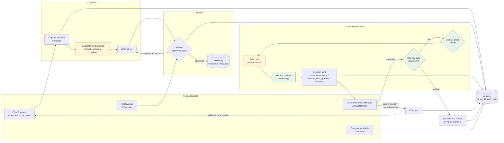
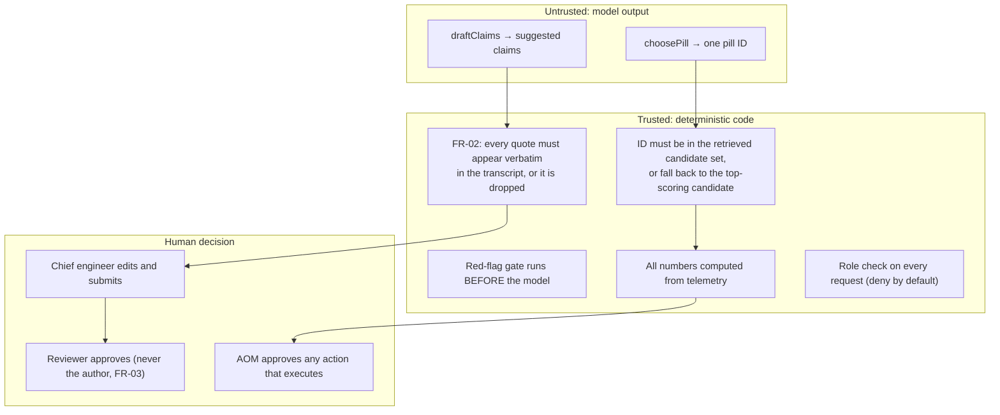
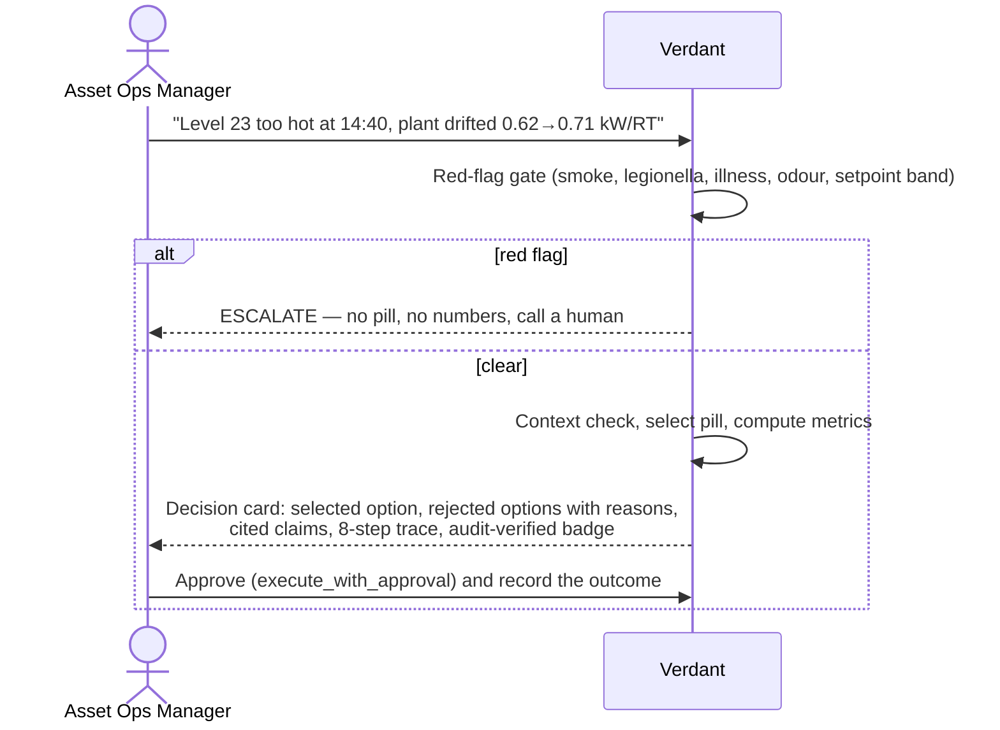
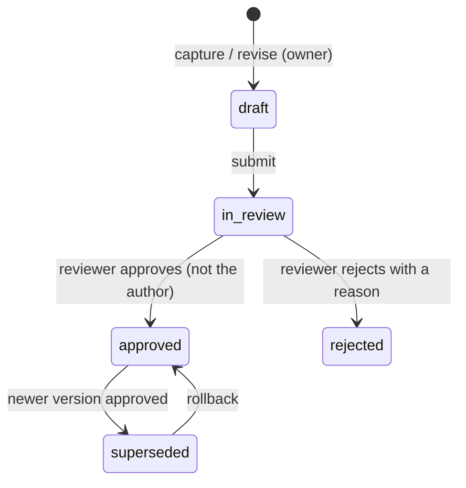

# Solution diagram — Verdant (Keppel · AI HARVEST)

**Chosen case study:** Real Estate track — *AI HARVEST: Turning Expert Know-How into Reusable
Intelligence*. Pill focus: **Energy Optimisation** and **Tenant Experience** for a Grade-A office
tower's chiller plant.

This page answers the eight points the challenge statement asks a solution diagram to show. Each
section names the code that implements it, and says plainly where something is designed but not
yet built. All data is synthetic.

---

## The whole system on one page

Yellow boxes are the only two places a model may act. Green boxes are deterministic code that the
model never touches.

### Trust boundary

---

## 1 · The business problem

Tower K's chiller retrofit reads as an aggregate success, but nobody can say which lever worked,
and the chief engineer who knows is retiring. The building has dashboards but not the engineer's judgement.
The hero case makes the cost concrete: plant efficiency drifted **0.6230 → 0.7130 kW/RT**, wasting
**1,836 kWh/day ≈ S$514/day**, and the intuitive fix (drop the building-wide chilled-water setpoint)
would *add* **S$642.60** while over-cooling every floor.

## 2 · Whose expertise, and how undocumented knowledge is obtained

The **Chief Engineer** (pill owner) is interviewed on the **Capture interview** screen.

1. The interview is recorded as a transcript (speaker + line).
2. **Suggest from transcript** drafts claims, each tagged `measured`, `derived`, `assumed` or
   `unknown`. It is AI-drafted when a model is configured, and a deterministic extractor
   otherwise.
3. Every non-`unknown` claim must cite a quote that appears **verbatim** in the transcript (FR-02).
   The code, not the model, decides whether a quote is genuine, and a fabricated quote is dropped
   and counted.
4. `unknown` is a first-class answer. What the engineer *doesn't* know is captured too, with no
   confidence attached.

Code: `frontend/src/pages/CaptureInterview.tsx`, `backend/src/modules/pills/claim-drafting.service.ts`,
`pill.service.ts → validateClaims`.

## 3 · How expertise becomes reusable rather than a one-off answer

A captured interview becomes a **pill**: triggers, steps, context requirements (asset type, chiller
plant, tariff, floor area), cited claims, and priced options ranked by policy tier
(Safety > Statutory > Lease comfort > Energy target > Preference). Once approved, a pill is
retrieved for **every future case** that matches its triggers, and re-applied with fresh numbers
computed from that day's telemetry. The answer is re-derived each time, never cached.

Retrieval is measured: precision **1.0**, recall **1.0** over 12 historical tickets
(`GET /api/pills/eval`).

## 4 · How the Asset Operations Manager uses, supervises and verifies it

The AOM **verifies** by reading the card. It shows which pill was used and its version, every claim
with the engineer's own words, why each option was ranked or rejected in policy terms, and an
audit badge proving the record is unedited. **Escalation** is automatic and structural: a red flag
stops the pipeline before any model or number is involved, and a context mismatch (wrong plant,
tariff or floor area) blocks the pill and prices nothing.

## 5 · Why this is more than a chatbot or retrieval tool

| A chatbot… | Verdant… |
|---|---|
| writes an answer | selects an **approved** pill by ID; it cannot write guidance |
| may invent numbers | computes every number in code from telemetry |
| answers anything | refuses outside its approved scope (gate, context check) |
| has no owner | each pill has an owner, a reviewer, and a version history |
| can't be rolled back | any regression rolls back to the exact version that worked |
| leaves no evidence | every step lands in a tamper-evident hash chain |

## 6 · How feedback and new expertise are reviewed, validated, versioned and approved

Outcomes recorded against a case (`POST /api/cases/:caseId/outcome`) are the evidence for the
next revision. A revision is version n+1 as a **draft**, and the live version is untouched until a
reviewer approves it. **Today** the step from outcome to revision is started by the engineer;
proposing that revision automatically from outcome data is the next increment.

## 7 · Extending from one asset to a portfolio

- **More assets:** the seeded world already has three sites (Tower K, Harbourfront One, KL Sentral
  Annex) and six pills across five domains (chiller plant, AHU, cooling tower, VAV box, tenant
  zone).
- **Safe transfer:** before a pill runs at another building, the **Transfer check** compares
  asset type, chiller plant, tariff (±S$0.02) and floor area. Applying Tower K's pill to
  Harbourfront One is **blocked** on three mismatches, so a pill cannot be silently misapplied.
- **More domains and business units:** a pill is a data record with a `domain`, not code. Leasing,
  sustainability or technical-services pills use the same capture → review → apply lifecycle and
  the same roles. Coordinating several specialist pills on one case (for example energy *and*
  tenant comfort) slots in at `select_pill` as a bounded fan-out over candidates.
- **Portable, vendor-independent:** pills, claims, transcripts and the audit chain are plain
  relational data (`data/schema.sql`). The model is replaceable behind one file and optional, and
  any OpenAI-compatible endpoint works, including Tencent Hunyuan.

## 8 · A credible path to implementation

| Step | Today | Next |
|---|---|---|
| Storage | In-memory, seeded deterministically | `data/schema.sql` + `data/seed.sql` already defined for Postgres + pgvector and executed in CI; wire the repository layer |
| Telemetry | Synthetic chiller readings | Read the BMS historian (kW, RT, CHWS/R temperatures) on the same schema |
| Identity | Role header | SSO / JWT mapped onto the same five roles |
| Model | Off by default; OpenAI-compatible | Tencent Hunyuan via `OPENAI_BASE_URL`, deployed on Tencent Cloud |
| Retrieval | Weighted token overlap (P = R = 1.0 on the eval) | pgvector semantic search, scored by the same eval harness |
| Feedback | Outcomes recorded | Auto-propose a draft revision from outcome data |

Everything in the "Today" column runs now with `npm run dev` and is covered by 103 automated tests.
